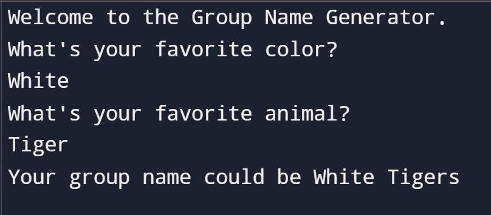

# Group Name Project

## Instruction

1. Create a greeting for your program.
2. Ask the user for their favorite color.
3. Ask the user for their favorite animal.
4. Combine the name of their favorite color and animal and show them their group name.

## Examples

```id="ex2"
Welcome to the Group Name Generator.
What's your favorite color?
> Red
What's your favorite animal?
> Lion
Your group name could be Red Lions
```

## Solution

https://github.com/Shreyas12js/python-real-world-projects/blob/main/02_group_name_generator/main.py

## Output Screenshot



