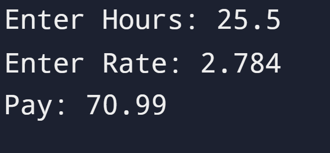

# Gross Pay Project

## Instruction

Write a program to prompt the user for hours and rate per hour to compute gross pay. You need to take into account that the result has exactly two digits after the decimal place.

## Input

```id="g1"
Enter Hours: 35
Enter Rate: 2.75
```

## Output

```id="g2"
Pay: 96.25
```

## Solution

https://github.com/<your-username>/python-real-world-projects/blob/main/03_gross_pay/main.py

## Output Screenshot



