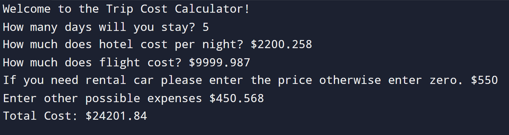

# Trip Cost Calculator

## Instruction

1. Create a greeting for your program.
2. Ask the user for number of days.
3. Ask the user for hotel price (per day).
4. Ask the user for flight price.
5. Ask the user for rental car price (per day).
6. Ask for other possible expenses.
7. Multiply hotel and car rental price with number of days.
8. Combine all expenses together and print total cost with 2 digits after decimal places.

## Input

```id="tc1"
Welcome to the Trip Cost Calculator!
How many days will you stay? 3
How much does hotel cost per night? $30
How much does flight cost? $50
If you need rental car please enter the price otherwise enter zero. $10
Enter other possible expenses $0
```

## Output

```id="tc2"
Total Cost: $170.00
```

## Solution

https://github.com/Shreyas12js/python-real-world-projects/blob/main/05_trip_cost_calculator/main.py

## Output Screenshot



