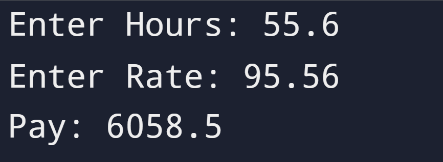

# Gross Pay with Overtime

## Instruction

Rewrite the Gross Pay Project (Project 3) program to give the employee 1.5 times the hourly rate for hours worked above 40 hours. The program prompts the user for hours and rate per hour to compute gross pay. You need to take into account that the result has exactly two digits after the decimal place.

Hint: overtime = hours - 40

## Input

```id="ot1"
Enter Hours: 45
Enter Rate: 5
```

## Output

```id="ot2"
Pay: 237.50
```

## Solution

https://github.com/Shreyas12js/python-real-world-projects/blob/main/06_gross_pay_with_overtime/main.py

## Output Screenshot



