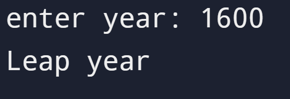

# Leap Year Project

## Instruction

Write a program that works out whether if a given year is a leap year.
A normal year has 365 days, leap years have 366, with an extra day in February.

The year must be evenly divisible by 4.
If the year can also be evenly divided by 100, it is not a leap year,
unless the year is also evenly divisible by 400.

## Input

```id="ly1"
Enter Year: 2000
```

## Output

```id="ly2"
Leap Year
```

## Solution

https://github.com/Shreyas12js/python-real-world-projects/blob/main/07_leap_year_checker/main.py

## Output Screenshot


