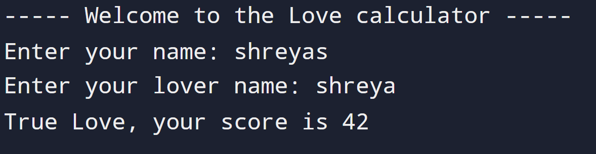

# Love Calculator

## Instruction

Write a program to test the compatibility between two people.

Take both people's names with combining two names and check for the number of times the letters in the word TRUE occur. Then check for the number of times the letters in the word LOVE occur. Then combine these numbers to make a 2 digit number.

Based on the score:

If the score is less than 25 or greater than 70 → Not a True Love
If the score is between 25 and 70 → True Love
Otherwise → Average Love

## Input

```id="lc1"
Enter your name: David
Enter your partner name: Jennifer
```

## Output

```id="lc2"
Your score is 33.
```

## Solution

https://github.com/Shreyas12js/python-real-world-projects/blob/main/08_love_calculator/main.py

## Output Screenshot


