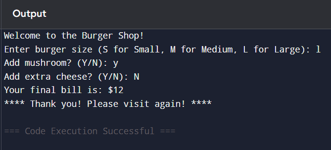

# 🍔 Burger Billing System (Python)

A simple Python program that calculates the final bill for a burger order based on user choices.  
This project is part of my **Python Real-World Projects** collection where I practice logic, input handling, and clean code design.

---

## 📌 Features
- Choose burger size (Small, Medium, Large)
- Optional Mushroom topping
- Optional Extra Cheese
- Dynamic price calculation based on choices
- Clean and readable Python logic

---

## 💲 Price List

| Item | Price |
|------|-------|
| Mini Burger (S) | $5 |
| Normal Burger (M) | $8 |
| Large Burger (L) | $10 |
| Add Mushroom (S/M) | +$1 |
| Add Mushroom (L) | +$2 |
| Extra Cheese | +$1 |

---

## 🧪 Example Output

