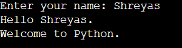

# Greeting Project

## Instruction

Write a program that uses input to prompt a user for their name and then welcomes them.

## Input

```
Shreyas
```

## Output

```
Hello Shreyas.
Welcome to Python.
```
## Solution

https://github.com/Shreyas12js/python-real-world-projects/blob/main/projects/01_greeting_app/main.py

## Output Screenshot


